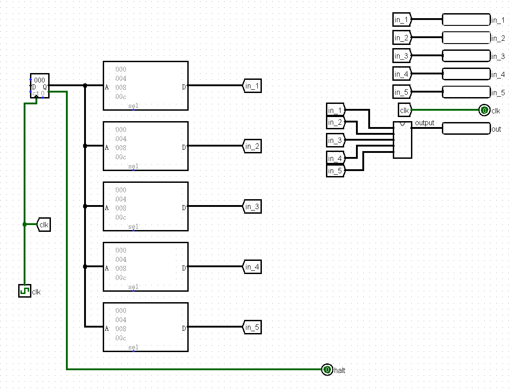
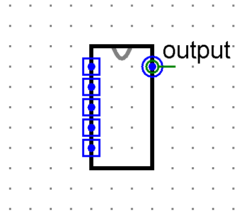
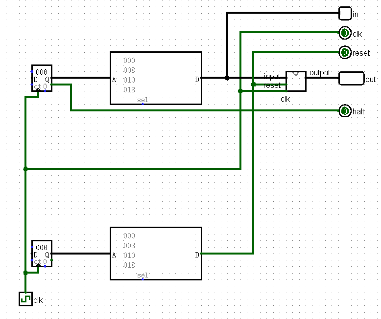
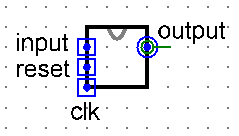

## P0_L2_nonexist_2023

# 未出现的正整数

本题中，你需要设计组合电路，找出输入中未出现的**最小正整数**。

## 提交要求

### 简介

使用 Logisim 搭建一个组合电路。给定输入的 5 个任意**无符号**二进制数。确定输入中未出现的**最小正整数**是多少。

例如：输入为 3，0，1，2，7 时，正整数 1，2，3 已经出现，未出现的最小正整数是 4。

### 输入输出

| 名称   | 功能     | 位宽 | 方向 |
| ------ | -------- | ---- | ---- |
| input1 | 数据输入 | 8    | I    |
| input2 | 数据输入 | 8    | I    |
| input3 | 数据输入 | 8    | I    |
| input4 | 数据输入 | 8    | I    |
| input5 | 数据输入 | 8    | I    |
| 输出   | 结果     | 8    | O    |

- **输入**：五个整数（8bit）
- **输出**：输入中未出现的**最小正整数**（8bit）
- **文件内模块名**: **main**
- **测试要求**：请以组合电路的方式实现，输入输出均使用 8 位无符号二进制数。
- **测试电路**：

- **注意：请保证模块的 appearance 与下图一致，否则有可能造成评测错误。外观的黑色矩形框大小可以不必调整，其余部分的相对位置必须正确。**

## 思路

维护未出现的最小值即可，仿照 c 语言的 if-else 语句，如果出现某个数，就更新相应的最小值，最后输出即可

具体实现请参照我的标程，总思路就是用子电路判定是否出现某数，用 MUX 模拟 if-else cao'zuo

## P0_L3_walker_2023

# 回字楼游走

本题中，你需要设计 Mealy 型状态机模拟在回型建筑中移动的学生。

## 提交要求

### 简介

某校有一栋回字型的建筑，可以分为八个单元，由右上角起顺时针编号为 1 至 8，结成一个环。现一名学生从编号 1（东北角）的单元开始移动。

- 当学生恰好移动向相邻单元方向时，学生进入该相邻单元，输出其编号。
- 当学生的移动方向上没有单元，这次不移动，直接输出当前所在单元格编号。

输入输出如下：

- 输入 `00` 时，学生试图向上（北）移动。
- 输入 `01` 时，学生试图向下（南）移动。
- 输入 `10` 时，学生试图向左（西）移动。
- 输入 `11` 时，学生试图向右（东）移动。
- 输出学生试图移动到的建筑单元。

### 输入输出

| 名称   | 功能         | 位宽 | 方向 |
| ------ | ------------ | ---- | ---- |
| input  | 方向输入     | 2    | I    |
| reset  | 异步复位信号 | 1    | I    |
| clk    | 时钟信号     | 1    | I    |
| output | 结果         | 4    | O    |

- **输入**：移动方式（2bit），异步复位信号（1bit），时钟信号（1bit）。
- **输出**：建筑单元编号（4bit）。
- **文件内模块名**: **main**
- **测试要求**：请以 Mealy 状态机的方式实现。
- **测试电路**：

- **注意：请保证模块的 appearance 与下图一致，否则有可能造成评测错误。注意输入的上下顺序。**

## P0_L5_hexnode_2023

# 忘了叫啥名

本题中，你需要设计 Moore 型状态机识别特定的连续十六进制数字序列。

## 提交要求

### 简介

输入输出如下：

- 输入 `EEE` 时，输出 `01`。
- 输入 `A0E` 时，输出 `10`。
- 输入 `0A0` 时，输出 `11`。

### 输入输出

| 名称   | 功能                           | 位宽 | 方向 |
| ------ | ------------------------------ | ---- | ---- |
| input  | 4bits 串行输入，模拟十六进制数 | 4    | I    |
| reset  | 异步复位信号                   | 1    | I    |
| clk    | 时钟信号                       | 1    | I    |
| output | 结果                           | 2    | O    |

- **输入**：十六进制数（4bit），异步复位信号（1bit），时钟信号（1bit）。
- **输出**：输出（2bit）。
- **文件内模块名**: **main**
- **测试要求**：请以 Moore 状态机的方式实现。

## 思路

最快的做法一定是移位寄存器，当然小东西们发了标程，我这老东西是无缘看到了。

标程的做法应该是取反，感觉不用取反，因为 `1` 是对输出结果无影响的，可以用 `1` 作为开头的标志位。

注意周期，第一个周期初始化移位寄存器时，应当将第一周期输入传入 parellel load 中

