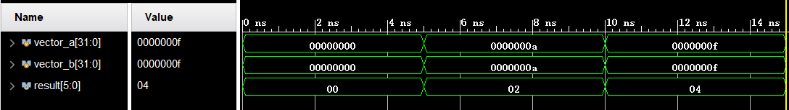
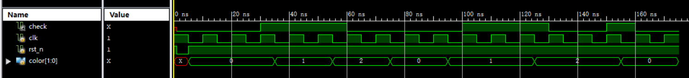

# P1 课上

> 2023.10.16

P1 仅仅看了简单的去年做过的 hdlbits 题目，一道题也没重写，编译数据库实在有点 push 了。上机题写的很丑陋，考场大部分同学都 3A 了，我最后压线 2A 的。~~无所谓，又活了一天，已经很厉害了~~

T1 组合逻辑忘了 for 循环的用法，用 dev 打了个表....

T2 优雅的分变量 always 块没写成，后来发现是因为 end 没匹配的 bug，但是屎山已经造出来了，硬着头皮改的

P1 课上真是依托，是烂到我差点就想摆烂的那种烂，自己都看不下去了，各位看官建议不要看我的原始垃圾代码了，我课下 remake 的文件命名为 `*_new.v` 了，也已通过课上测试，优化过的版本倒是还能入眼。


## P1_L1_dotProduct_2023

# Verilog向量点乘

## 提交要求

## 1、简介

在实现矩阵乘操作时，往往可以将其分解为若干向量的点乘操作来执行。现在，请你设计一个向量点乘模块，实现向量的点乘操作。

为了简化题目，我们用两个位宽为 32 的 wire 型变量来表示两个需要点乘的 32 维向量，也就是说，向量任何一个维度的值只能为 0 或 1。你需要将两个向量同一位置相乘并将所有位置的乘积相加输出。

## 2、模块规格

模块名：dotProduct

| 信号名         | 方向   | 描述            |
| -------------- | ------ | --------------- |
| vector_a[31:0] | input  | 需要点乘的向量a |
| vector_b[31:0] | input  | 需要点乘的向量b |
| result[5:0]    | output | 点乘结果        |

## 3、输入输出样例



## 4、提交要求

- 必须严格按照模块的端口定义。
- 文件内模块名: dotProduct。
- **模块内不要包含任何 $display 语句**，以防造成误判。


## 思路

在 for 循环内按位或再求和即可

两个注意：

- sum 要清零


## P1_L4_coloring_2023

# Verilog 涂色问题

## 提交要求

## 1、简介

小 B 同学准备对一列格子进行涂色，他想要使用红色，绿色，蓝色三种颜色，但是要求如下：同一颜色不得连续出现三次，红色不得与绿色相连。

我们将在每个周期通过 color 端口输入一个颜色代号：0（红色），1（绿色），2（蓝色），你需要设计 Moore 状态机来检测该涂色序列的合法性，并在检测到**不合法**的序列之后将输出端口 check 置为 1。

另外，在检测到不合法序列之后，小 B 同学会将最近的一次涂色擦除，重新涂色。

## 2、模块规格

模块名：coloring

| 信号名     | 方向 | 描述                       |
| ---------- | ---- | -------------------------- |
| clk        | I    | 时钟信号                   |
| rst_n      | I    | 异步复位信号（低电平有效） |
| color[1:0] | I    | 涂色信号                   |
| check      | O    | 当前序列合法性             |

## 3、输入输出样例

如下方波形图，输入序列为 0 0 0 1 1 2 2 0 0 1 1 1 2 2 2。 前两个周期的输入结束后，已经有 2 个连续的格子被涂为红色，第 3 个周期的输入仍为 0，此时有三个连续的同色的格子，序列不合法，check 的值变为 1，同时擦除最后一次涂色，即第三个格子的红色，现在仍然是有两个连续的红色格子。接下来输入 1，此时红色与绿色格子相邻，序列不合法，check 的值仍为 1，擦除最后一次涂色，即第三个格子的绿色，接下来输入的 1 同理。接下来输入 2，此时的序列合法，check 的值变为 0，有三个格子成功涂色，颜色分别为红、红、蓝。接下来的输入同理，输入结束后，格子的颜色序列为：红、红、蓝、蓝、红、红、蓝、蓝。



## 4、提交要求

- 必须严格按照模块的端口定义。
- 文件内模块名: coloring。
- **模块内不要包含任何 $display 语句**，以防造成误判。


## 思路

计数问题都有固定的解题思路，也可参考 HDLBits 上的 [Lemmings4](https://hdlbits.01xz.net/wiki/Lemmings4)

我的题解贴在这里

```verilog
module top_module(
    input clk,
    input areset,    // Freshly brainwashed Lemmings walk left.
    input bump_left,
    input bump_right,
    input ground,
    input dig,
    output walk_left,
    output walk_right,
    output aaah,
    output digging ); 
    
    parameter LEFT = 3'b000, RIGHT = 3'b001, DIGGING_LEFT = 3'b010, DIGGING_RIGHT = 3'b011,
              FALLING_LEFT = 3'b100, FALLING_RIGHT = 3'b101, SPLATTER = 3'b110, DEAD = 3'b111;
    
    reg [2:0] state, next_state;
    // reg [7:0] count;
    integer count = 0;
    
    // combinational logic
    always @(*) begin
        case(state)
            LEFT: begin
                if(~ground) next_state = FALLING_LEFT;
                else if(dig) next_state = DIGGING_LEFT;
                else if(bump_left) next_state = RIGHT;
                else next_state = LEFT;
            end
            RIGHT: begin
                if(~ground) next_state = FALLING_RIGHT;
                else if(dig) next_state = DIGGING_RIGHT;
                else if(bump_right) next_state = LEFT;
                else next_state = RIGHT;
            end
            DIGGING_LEFT: begin
                if(~ground) next_state = FALLING_LEFT;
                else next_state = DIGGING_LEFT;
            end
            DIGGING_RIGHT: begin
                if(~ground) next_state = FALLING_RIGHT;
                else next_state = DIGGING_RIGHT;
            end
            FALLING_LEFT: begin
                if(~ground) begin
                    if(count >= 20) next_state = SPLATTER;
                    else next_state = FALLING_LEFT;
                end
                else if(ground && count < 20) next_state = LEFT;
            end
            FALLING_RIGHT: begin
                if(~ground) begin
                    if(count >= 20) next_state = SPLATTER;
                    else next_state = FALLING_RIGHT;
                end
                else if(ground && count < 20) next_state = RIGHT;
            end
            SPLATTER: begin
                if(ground) next_state = DEAD;
                else next_state = SPLATTER;
            end
            DEAD: begin
                next_state = DEAD;
            end
            default: begin
                next_state = DEAD;
            end
        endcase
    end
    
    // state transition
    always @(posedge clk, posedge areset) begin
        if(areset) state <= LEFT;
        else state <= next_state;
    end
    
    // count block
    always @(posedge clk, posedge areset) begin
        if(areset) count = 0;
        else if(next_state == FALLING_LEFT || next_state == FALLING_RIGHT || next_state == SPLATTER) count = count + 1;
        else count = 0;
    end
    
    assign aaah = ((state == FALLING_LEFT) | (state == FALLING_RIGHT) | (state == SPLATTER));
    assign walk_left = (state == LEFT);
    assign walk_right = (state == RIGHT);
    assign digging = ((state == DIGGING_LEFT) | (state == DIGGING_RIGHT));
    
endmodule
```


剩下一道题只记得是嵌套数列啥的，真的没看，最后只剩 5min 了，我这老东西对不住大家