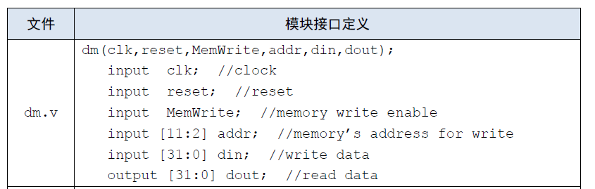
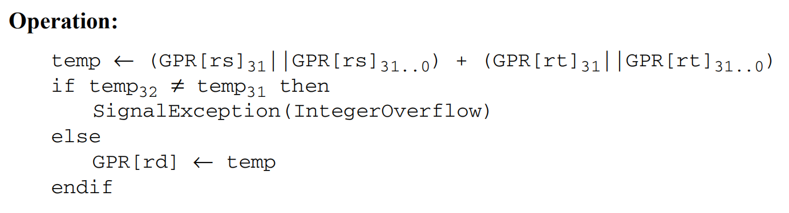
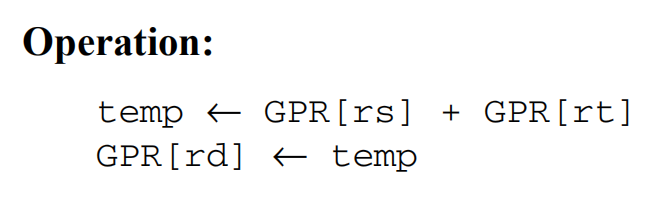

# P4 设计文档

[TOC]

# 设计草稿

## 一、设计与测试说明

1. 处理器为 32 位单周期处理器

2. 不考虑延迟槽

3. 支持的指令集为{add（不支持溢出，事实上为addu），sub（不支持溢出，事实上为subu），ori，lw，sw，beq，lui，jal，jr，nop}

4. 采用模块化和层次化设计，顶层文件为 mips.v，有效驱动信号仅包括**同步复位**信号 reset 和时钟信号 clk，接口定义如下：

   ```verilog
   module mips(
       input clk,
       input reset
   );
   ```

5. 我个人实现的指令集为{add（不支持溢出，事实上为addu），sub（不支持溢出，事实上为subu），*addi*，*xor*，ori，lw，*lb*， sw，beq，*bgtz*，lui，jal，jr，nop}

   > *Italic* 部分为我新增的指令


## 二、整体结构

### 1.模块规格

- IFU
  - 端口说明
  
    | 序号 |     信号名      | 方向 |                            描述                            |
    | :--: | :-------------: | :--: | :--------------------------------------------------------: |
    |  1   |       clk       |  I   |                          时钟信号                          |
    |  2   |      reset      |  I   |          同步复位信号<br>1'b1：清零<br>1'b0：保持          |
    | 3 | NPC[31:0] | I | 32 位当前指令计数，接收 NPC 的 NPC 信号 |
    |  4   |     PC[31:0]     |  O   |          输出 NPC 信号           |
    |  5   |   Instr[31:0]   |  O   |                      32 位 MIPS 指令                       |
  
  - 功能定义
  
    | 序号 |   功能   |                   描述                    |
    | :--: | :------: | :---------------------------------------: |
    |  1   | 同步复位 | reset 信号为 1'b1 时，置 PC 为 0x00003000 |
    |  2   |  取指令  |       根据 PC 的值从 IM 中取出指令        |
    |  3   | 输出 PC  |             输出当前指令计数              |


- NPC

    - 端口说明
      
        | 序号 |     信号名      | 方向 |                   描述                   |
        | :--: | :-------------: | :--: | :--------------------------------------: |
        |  1   |  NPCControl[2:0] |  I   |    接收 Controller 的 NPCControl 信号    |
        | 2 | Zero | I | ALU 运算结果是否为 0 |
        | 3 | GreaterZero | I | SrcA 是否 > 0的标志信号，接收 ALU 的 GreaterZero 信号 |
        | 4 | LessZero | I | SrcA 是否 < 0的标志信号，接收 ALU 的 LessZero 信号 |
        | 5 | Beq | I | 当前指令是否为 beq |
      | 6 | Bgtz | I | 当前指令是否为 bgtz |
      |  7   |    PC[31:0]     |  I   |           接收 IFU 的 PC 信号            |
      |  8   |   Imm26[25:0]   |  I   |       接收 Splitter 的 Imm26 信号        |
      |  9   | EXTImm32[31:0]  |  I   |        接收 EXT 的 EXTImm32 信号         |
      |  10  |     GRF[rs]     |  I   |            接收 GRF[rs] 的值             |
      | 11 |    NPC[31:0]    |  O   |         Next PC，下一条指令计数          |
      |  12  |       PC4       |  O   |                  PC + 4                  |
      
    - 功能定义
      
        | 序号 |    功能     |                             描述                             |
        | :--: | :---------: | :----------------------------------------------------------: |
        |  1   |  计算 NPC   | 根据NPCControl 计算 NPC<br>$NPCControl = 3'b000 $ 时：递增，$NPC = PC + 4$<br>$NPCControl = 3'b001$ 时：计算 beq bgtz 指令地址：<br>$NPC = PC + 4 + sign\_extend(offset||0^2)$<br/>$NPCControl = 3'b010$ 时：计算 j jal 指令地址：<br/>$NPC = PC[31:28]||instr\_index||0^2$ <br>$NPCControl = 3'b100$ 时：计算 jr jalr 指令地址：<br/>$NPC = GRF[rs]$ |
        |  2   | 输出 PC + 4 |                              -                               |


- GRF

  - 端口说明

    | 序号 | 信号名 | 方向 | 描述 |
    | :----: | :------: | :----: | :----: |
    | 1    | clk    | I    | 时钟信号 |
    | 2 | reset | I | 同步复位信号<br>1b'1：清零<br>1'b0：保持 |
    | 3 | RegWrite | I | 写使能信号，接受 RegWrite <br>1'b1：可写入数据<br>1'b0：不可写入数据 |
    | 4 | A1[4:0] | I | 5 位地址位选信号，接收 rs |
    | 5 | A2[4:0] | I | 5 位地址位选信号，接收 rt |
    | 6 | RegAddr[4:0] | I | 5 位地址位选信号，选择写入的寄存器 |
    | 7 | RegData[31:0] | I | 32 位写入数据 |
    | 8 | RD1[31:0] | O | 输出 GRF[rs] |
    | 9 | RD2[31:0] | O | 输出 GRF[rt] |
    
  - 功能定义

    | 序号 | 功能 | 描述 |
    | :----: | :----: | :----: |
    | 1 | 同步复位 | reset 信号为 1'b1 时，将所有寄存器清空为 32'b0 |
    | 2 | 读寄存器 | 将 A1 和 A2 对应的寄存器中的值输出到 RD1 和 RD2 |
    | 3 | 写寄存器 | RegWrite 为 1'b1 且 RegAddr 不为 5'b0 时，在时钟上升沿将 RegData 的值写入到 RegAddr 对应的寄存器中 |
    


- ALU

  - 端口说明

    | 序号 | 信号名 | 方向 | 描述 |
    | :----: | :------: | :----: | :----: |
    | 1 | SrcA[31:0] | I | 第一个运算数 |
    | 2 | SrcB[31:0] | I | 第二个运算数 |
    | 3 | ALUControl[2:0] | I | ALU 控制信号，对应的操作为：<br>3'b000：+<br>3'b001：-<br>3‘b010：\^（按位异或）<br>3'b011：\|（按位）<br>3'b100：<<（左移） |
    | 4 | shamt[4:0] | I | - |
    | 5 | Zero | O | SrcA 与 SrcB是否相等的标志信号：<br>1'b1：相等<br>1'b0：不相等 |
    | 6 | GreaterZero | O | SrcA 是否 > 0的标志信号 |
    | 7 | LessZero | O | SrcA 是否 < 0的标志信号 |
    | 8 | ALUResult[31:0] | O | SrcA 与 SrcB 运算结果 |
    
  - 功能定义
    | 序号 |          功能           |                     描述                     |
    | :--: | :---------------------: | :------------------------------------------: |
    |  1   |          加法           |        输出 SrcA + SrcB 到 ALUResult         |
    |  2   |          减法           |        输出 SrcA - SrcB 到 ALUResult         |
    |  3   |         按位与          |        输出 SrcA & SrcB 到 ALUResult         |
    |  4   |         按位或          |        输出 SrcA \| SrcB 到 ALUResult        |
    |  5   |          左移           |       输出 SrcA << shamt 到 ALUResult        |
    |  6   |        判断相等         |            输出 Zero 信号到 Zero             |
    |  7   | 判断 SrcA 与 0 大小关系 | 大于置 GreaterZero 为 1，反之置 LessZero 为1 |


- Controller

  - 端口说明
    | 序号 |     信号名      | 方向 |                             描述                             |
    | :--: | :-------------: | :--: | :----------------------------------------------------------: |
    |  1   |   opcode[5:0]   |  I   |               32 位 MIPS 指令中的 opcode 字段                |
    |  2   |   funct[5:0]    |  I   |                32 位 MIPS 指令中的 funct 字段                |
    |  3   | ALUControl[2:0] |  O   |      ALU 控制信号，确定 ALU 执行的功能，端口说明见 ALU       |
    |  4   |     MemRead     |  O   |                          DM 读信号                           |
    |  5   |    MemWrite     |  O   |                          DM 写信号                           |
    |  6   |    RegWrite     |  O   |                          GRF 写信号                          |
    |  7   |  Mem2Reg[2:0]   |  O   | GRF 写入数据的选择信号<br>3'b0：ALU 运算结果<br>3'b1：Memory[Addr]<br>3'b10：EXT 运算结果<br>3'b11：PC + 4 |
    |  8   | EXTControl[1:0] |  O   | EXT 扩展方式选择信号<br>2'b00：零扩展<br>2'b01：符号扩展<br>2'b10：低 16 位零扩展 |
    |  9   |     ALUSrc      |  O   | ALU 的第二个操作数选择信号<br>1'b0：RD2<br>1'b1：EXT 扩展的立即数 |
    |  10  |   RegDst[1:0]   |  O   |   寄存器写地址控制<br>2'b00：rt<br>2'b01：rd<br>2'b10：31    |
    |  11  | NPCControl[2:0] |  O   | NPC 计算方式选择信号<br>3'b000：递增<br>3'b001：beq 指令跳转<br>3'b010：j 指令跳转<br>3'b011：GRF[rs] |
    |  12  |       Beq       |  O   |                      当前指令是否为 beq                      |
    |  13  |      Bgtz       |  O   |                     当前指令是否为 bgtz                      |
  - 功能定义
    | 序号 |                      功能                      | 描述 |
    | :--: | :--------------------------------------------: | :--: |
    |  1   |               产生 ALU 控制信号                |  -   |
    |  2   |               产生 GRF 控制信号                |  -   |
    |  3   |                产生 DM 控制信号                |  -   |
    |  4   |               产生 EXT 控制信号                |  -   |
    |  5   |               产生 IFU 控制信号                |  -   |
    |  6   | 输出当前指令是否为特定指令（对于 beq 与 bgtz） |  -   |


- EXT

  - 端口说明
    | 序号 |     信号名      | 方向 |                             描述                             |
    | :--: | :-------------: | :--: | :----------------------------------------------------------: |
    |  1   |   Imm16[15:0]   |  I   |                    16 位需要扩展的立即数                     |
    |  2   | EXTControl[1:0] |  I   | 符号扩展的标志信号<br>接收 Controller 产生的 EXTControl 信号<br>2'b00：零扩展<br>2'b01：符号扩展<br>2'b10：低位零扩展 |
    |  3   | EXTResult[31:0] |  O   |                        32 位扩展结果                         |
  - 功能定义
    | 序号 |     功能     | 描述 |
    | :--: | :----------: | :--: |
    |  1   | 高位符号扩展 |  -   |
    |  2   |  高位零扩展  |  -   |
    |  3   |  低位零扩展  |  -   |


- DM

  - 端口说明
    | 序号 |      信号名       | 方向 |                    描述                    |
    | :--: | :---------------: | :--: | :----------------------------------------: |
    |  1   |        clk        |  I   |                  时钟信号                  |
    |  2   |       reset       |  I   | 同步复位信号<br/>1'b1：清零<br/>1'b0：保持 |
    |  3   |     MemWrite      |  I   |  写控制信号<br>1'b1：可写<br>1'b0：不可写  |
    |  4   |      MemRead      |  I   |  读控制信号<br>1'b1：可读<br>1'b0：不可读  |
    |  5   |     |     PC[31:0]      |  I   |             用于 $display 输出             |
    |  6   |   MemAddr[31:0]   |  I   |             32 位地址位选信号              |
    |  7   |   MemData[31:0]   |  I   |            写入内存的 32 位数据            |
    |  8   | MemReadData[31:0] |  O   |           从内存读出的 32 位数据           |
    |  9   |   ReadByteData    |  O   |           lb 指令得到的运算结果            |
  - 功能定义
    | 序号 |   功能   |                             描述                             |
    | :--: | :------: | :----------------------------------------------------------: |
    |  1   | 同步复位 |              reset 信号为 1'b1 时，清空所有 RAM              |
    |  2   |  读内存  | MemRead 为 1'b1 时，将 MemAddr 对应地址中的值读出到 MemReadData |
    |  3   |  写内存  | MemWrite 为 1'b1 时，将 MemData 的值写入到 MemAddr 对应的内存中 |


# 思考题

## 数据通路设计

思考题

阅读下面给出的 DM 的输入示例中（示例 DM 容量为 4KB，即 32bit × 1024字），根据你的理解回答，这个 addr 信号又是从哪里来的？地址信号 addr 位数为什么是 [11:2] 而不是 [9:0] ？



> lw 和 sw 的地址计算结果由 ALU 得到，以字节为单位，而 addr 信号以字为单位，需要除 4 ，即右移两位
>
> DM 需要 10 位位选信号，所以需要取低 10 位，考虑右移应该取 [11:2]


## 控制器设计

思考题

思考上述两种控制器设计的译码方式，给出代码示例，并尝试对比各方式的优劣。

> 代码示例如下：
>

```verilog
wire add, sw, lui;
assign add = (opcode == 6'b000000) & (funct == 6'b100000);
assign sw  = (opcode == 6'b101011);
assign lui = (opcode == 6'b001111);

assign EXTControl = {lui, sw};
assign MemWrite = sw;
assign RegWrite = add | lui;
assign ALUSrc = sw | lui;
assign RegDst = add;
```

```verilog
`define R   6'b000000
`define ADD 6'b100000
`define SUB 6'b100010
`define SW  6'b101011
`define LUI 6'b001111

case(opcode)
	`R: begin
        case(funct)
			`ADD: begin
				RegDst = 1;
				RegWrite = 1;
			end
            `SUB: begin
                RegDst = 1;
                RegWrite = 1;
            end
            // other R type instructions
			default: //...
		endcase
	end
	`SW: begin
        ALUSrc = 1;
        MemWrite = 1;
        EXTControl = 2'b01;
    end
    `LUI: begin
        ALUSrc = 1;
        MemWrite = 1;
        EXTControl = 2'b10;
    end
endcase
```

> 两种方式的优劣：
>
> 第一种方式优点是代码量更小；缺点是耦合度较高，每次添加新指令时都需要改变控制信号的计算方式
>
> 第二种方式优点是对于每种指令的行为更为明确，耦合度低，可扩展性好；缺点是代码量较大，case 语句中每个分支所需的控制信号赋值语句较为复杂


## 在线测试相关信息

思考题

在相应的部件中，复位信号的设计都是**同步复位**，这与 P3 中的设计要求不同。请对比**同步复位**与**异步复位**这两种方式的 reset 信号与 clk 信号优先级的关系。

> 同步复位中，reset 信号的优先级与 clk 信号相同，都作为 always 块的敏感信号
>
> 异步复位中，reset 信号优先级高于 clk 信号，在 reset 信号高电平时，不需要在时钟上升沿便会触发复位


C 语言是一种弱类型程序设计语言。C 语言中不对计算结果溢出进行处理，这意味着 C 语言要求程序员必须很清楚计算结果是否会导致溢出。因此，如果仅仅支持 C 语言，MIPS 指令的所有计算指令均可以忽略溢出。 请说明为什么在忽略溢出的前提下，addi 与 addiu 是等价的，add 与 addu 是等价的。提示：阅读《MIPS32® Architecture For Programmers Volume II: The MIPS32® Instruction Set》中相关指令的 Operation 部分 。

> 对于 add 与 addu 这一组指令：
>
> add：
>
> 
>
> addu：
>
> 
>
> 因为在指令为 add 时，GPR[rd] 只能保存 temp 的低 32 位，其结果数值上与 addu 计算得到的 temp 相同
>
> 对于 addi 与 addiu 同理


